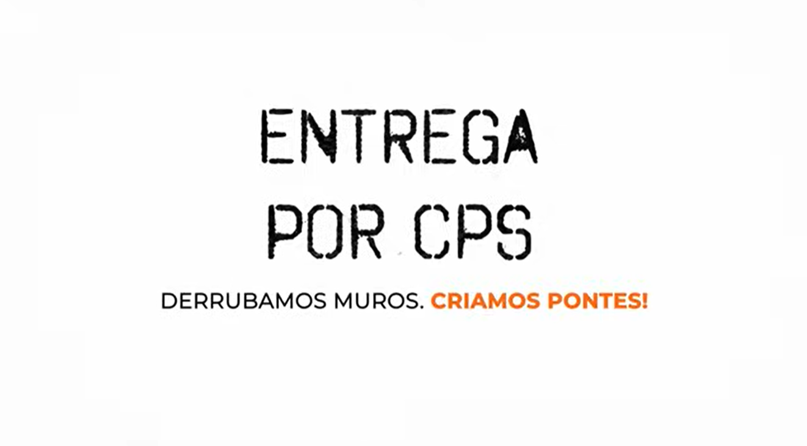

# desafio-fic-2026-grupo-re-act
Projeto proposto pelo grupo re-act durante a participação do FATEC Innovation Challenge (FIC) 2026. 

Composição do grupo: Igor Iansen, Igor de Souza, Lorenzo Milanelo e Vitor Hirch

A documentação presente neste repositório foi desenvolvida de forma a trazer uma solução tecnológica para a ONG Entrega por Campinas. 

## 🎬 Pitch do projeto

