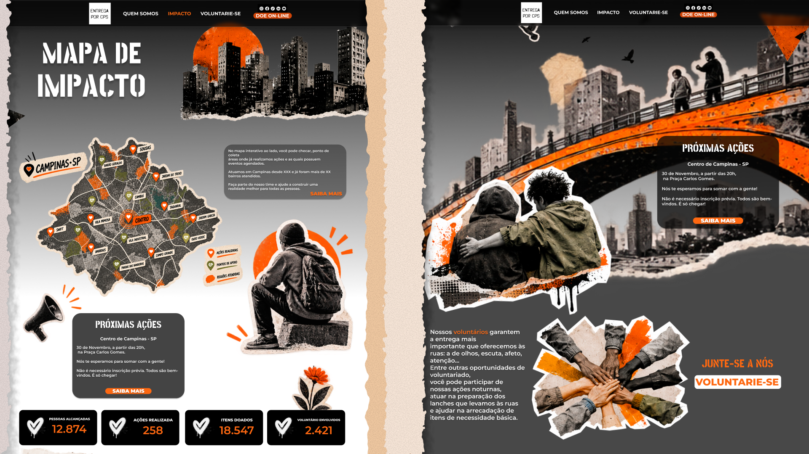

#  FIC 2026 — Grupo Re-act

Projeto desenvolvido pelo grupo **Re-act** durante o **FATEC Innovation Challenge (FIC) 2026**, com o desafio de propor uma solução tecnológica para a **ONG Entrega por Campinas**.

## Sobre o projeto

O projeto nasceu a partir da necessidade de aproximar **pessoas, recursos e ações sociais**, tornando mais organizada e transparente a forma como doações e voluntários são conectados às necessidades da comunidade.

Nossa proposta busca utilizar a tecnologia para apoiar a ONG na **gestão de campanhas, voluntários e doações**, além de tornar mais visível o impacto gerado por cada ação.

A ideia central é transformar recursos e iniciativas em **impacto social mensurável e compreensível**, criando uma ponte entre quem quer ajudar e quem precisa de ajuda.

> **Derrubamos muros. Criamos pontes.**

## 💡 A solução

A proposta consiste em uma plataforma digital que conecta diferentes participantes da iniciativa — como **doadores, voluntários, colaboradores e administradores** — em um mesmo ambiente.

Entre as principais funcionalidades idealizadas estão:

- **Campanhas baseadas em necessidades reais**, mostrando quais recursos são necessários;
- **Gestão de voluntários**, permitindo acompanhar inscrições e disponibilidade;
- **Acompanhamento das doações e ações realizadas**;
- **Visualização do impacto social**, utilizando dados e mapas para mostrar onde as ações acontecem;
- **Painel administrativo**, auxiliando a ONG na organização de campanhas, voluntários e resultados;
- **Transparência do impacto**, mostrando como recursos e ações se transformam em resultados para a comunidade.

Nesta etapa do desafio, o foco foi desenvolver a **proposta de solução, experiência do usuário, protótipos e arquitetura do sistema**, estabelecendo uma base para uma futura implementação.

## Visão da proposta

## 🎬 Pitch do projeto

Clique na imagem para assistir ao vídeo de defesa da proposta:

## 📁 Documentação

A documentação do projeto está organizada na pasta [`proposta_FIC_Re-act`](./proposta_FIC_Re-act), contendo os principais materiais desenvolvidos durante o desafio.

### 📌 Principais entregas

- [📄 Proposta de Impacto](./proposta_FIC_Re-act/Proposta_de_impacto_re-act.pdf)
- [📋 Product Backlog](./proposta_FIC_Re-act/Product_Backlog_re-act.pdf)
- [🎨 Protótipos](./proposta_FIC_Re-act/Prototipo)
- [🏗️ Diagramas de Arquitetura](./proposta_FIC_Re-act/Diagramas_de_Arquitetura)
- [🎬 Link do vídeo](./proposta_FIC_Re-act/Link_Video.txt)

## 🛠️ Processo

Durante o desenvolvimento, o grupo trabalhou na compreensão do problema, definição da solução, construção da experiência do usuário, elaboração dos protótipos e planejamento técnico da plataforma.
A proposta foi estruturada utilizando conceitos de **UX/UI, desenvolvimento de software e metodologias ágeis**, buscando equilibrar impacto social, experiência do usuário e viabilidade tecnológica, para a ordem de priorização inicial do MVP utilizamos o método de MOSCOW assim definindo as principais funcionalidades do projeto, além disso utilizamos o Mermaid para a elaboração dos diagramas de arquitetura e por fim o Figma para prototipação de algumas das principais telas. 
Achamos importante ressaltar que esta é a fase inicial do projeto as entregas foram definidas de acordo com o solicitado na atual fase do desafio. 

## 👥 Equipe

**Grupo Re-act**

- Igor Iansen
- Igor de Souza
- Lorenzo Milanelo
- Vitor Hirch

---

### 🏆 FATEC Innovation Challenge 2026

Projeto desenvolvido como parte do **FIC 2026**, unindo tecnologia, design e inovação para propor uma solução voltada ao impacto social.
